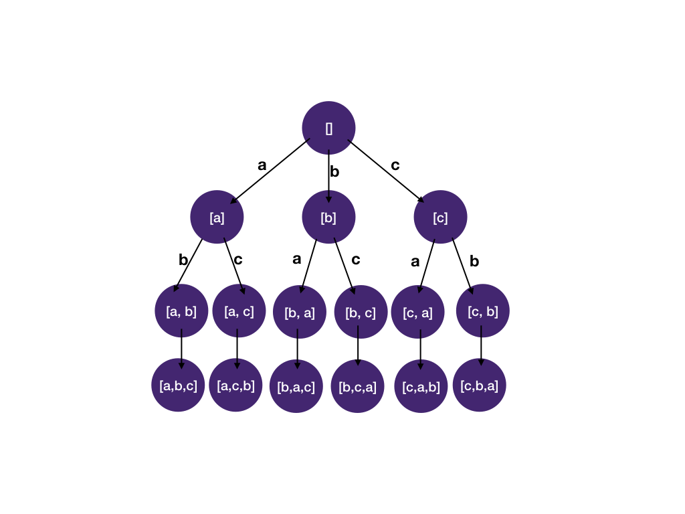

# Math for Technical Interviews

## Seberapa banyak matematika yang perlu saya kuasai untuk wawancara teknis?

Jawaban singkatnya: cukup matematika setingkat SMA.

Ilmu komputer sering dikaitkan dengan matematika, dan di beberapa universitas bahkan jurusan ilmu komputer berada di bawah fakultas matematika. Namun, pada kenyataannya, sebagian besar wawancara untuk posisi software engineer dan pekerjaan sehari-hari di bidang rekayasa perangkat lunak hanya memerlukan matematika dasar setingkat SMA.

## Tapi saya pernah melihat soal di LeetCode yang butuh trik matematika rumit

LeetCode memiliki lebih dari 2000 soal, sebagian besar dikirimkan oleh pengguna. Jadi, keberadaan satu soal yang melibatkan trik matematika tertentu di antara ribuan soal tidak terlalu berarti. Yang penting adalah apakah soal semacam itu benar-benar muncul dalam wawancara sesungguhnya. Jika melihat daftar soal yang paling sering ditanyakan perusahaan besar, soal yang membutuhkan trik atau rumus matematika tingkat lanjut sangat jarang muncul. Soal yang mengandalkan pengetahuan matematika khusus lebih bersifat knowledge test, sedangkan wawancara teknis dirancang untuk menguji kemampuan coding dan problem-solving, bukan hafalan rumus matematika.

## Bagaimana kalau saya sial dan dapat soal matematika yang susah?

Di kebanyakan perusahaan, hasil penilaian kandidat ditinjau ulang oleh insinyur lain di luar pewawancara. Jika sebuah pertanyaan dianggap terlalu sulit atau tidak relevan, maka sesi tersebut akan diberi bobot lebih kecil dalam keputusan akhir. Jadi, tidak perlu terlalu khawatir jika Anda tidak menguasai matematika lanjutan.

## Memahami Sistem Bilangan (Number Bases)

Sebelum masuk ke konsep logaritma, penting untuk memahami konsep “basis” dalam matematika. Basis menentukan jumlah digit unik dan nilai yang diwakili oleh setiap posisi dalam suatu sistem bilangan.

### Basis 10 (Desimal)

Manusia secara alami menggunakan sistem desimal (basis 10) dengan sepuluh digit unik: 0 hingga 9. Polanya sederhana — setelah mencapai angka 9, kita menambah satu digit di depan dan mulai lagi dari 10. Setiap posisi digit ke kiri mewakili pangkat 10 yang lebih tinggi.

Contoh pada angka 352:

- Digit 2 berada di posisi satuan (10⁰)
- Digit 5 berada di posisi puluhan (10¹)
- Digit 3 berada di posisi ratusan (10²)

### Transisi ke Basis 2 dalam Ilmu Komputer

Sebaliknya, komputer beroperasi menggunakan sistem biner (basis 2), yang hanya memiliki dua digit unik: 0 dan 1. Hal ini disebabkan oleh sifat logika elektronik komputer yang berbasis keadaan on/off atau true/false. Dalam sistem biner, setiap posisi dari kanan mewakili pangkat 2 yang meningkat.

Contoh pada bilangan biner 1011:

- 1 paling kanan berada di posisi satuan (2⁰)
- 1 berikutnya di posisi dua (2¹)
- 0 menunjukkan tidak ada nilai di posisi empat (2²)
- 1 paling kiri di posisi delapan (2³)

## Pengenalan Logaritma (Logarithms)

### Apa itu logaritma?

Logaritma menjawab pertanyaan: *“Pangkat berapa yang harus diberikan pada suatu basis agar menghasilkan bilangan tertentu?”*
Secara sederhana, logaritma adalah kebalikan dari fungsi eksponensial.

### Contoh Eksponensial dengan Basis 2

- 2² = 2 × 2 = 4
- 2³ = 2 × 2 × 2 = 8
- 2⁴ = 2 × 2 × 2 × 2 = 16

### Memahami Logaritma dengan Basis 2

Diberikan suatu bilangan, logaritma memberi tahu kita berapa kali 2 harus dikalikan untuk mendapatkan bilangan tersebut.

- log₂(8) = 3 → karena 2 × 2 × 2 = 8
- log₂(16) = 4 → karena 2 × 2 × 2 × 2 = 16

Atau bisa juga dipahami sebagai: logaritma menunjukkan berapa kali sebuah bilangan dapat dibagi 2 hingga tersisa 1.

- 8 ÷ 2 ÷ 2 ÷ 2 = 1 → maka log₂(8) = 3
- 16 ÷ 2 ÷ 2 ÷ 2 ÷ 2 = 1 → maka log₂(16) = 4

Logaritma, khususnya dengan basis 2, sangat penting dalam ilmu komputer karena banyak permasalahan komputasi secara alami terbagi dua di setiap langkah (misalnya dalam algoritma binary search atau struktur data seperti binary tree).

## Permutations and factorial

### Himpunan dan Urutan (Sets and Sequences)

**Himpunan (Set):**
Himpunan adalah kumpulan elemen-elemen yang berbeda (tidak duplikat), dan urutannya tidak penting.
Contoh: {a, b} — ini sama saja dengan {b, a} karena urutan tidak berpengaruh.

**Permutasi (Permutation):**
Permutasi adalah *urutan khusus* dari elemen-elemen dalam suatu himpunan.
Berbeda dengan himpunan, dalam permutasi urutan sangat penting.
Untuk himpunan {a, b}, terdapat dua permutasi yang mungkin: [a, b] dan [b, a].

**Gambaran semua permutasi dari (a, b, c):**

- [a, b, c]
- [a, c, b]
- [b, a, c]
- [b, c, a]
- [c, a, b]
- [c, b, a]

Ada 6 permutasi dari tiga elemen, yang dapat dihitung menggunakan faktorial (n!), di mana:
n! = n × (n - 1) × (n - 2) × ... × 1

### Counting permutations

**Bayangkan kita menyusun tiga huruf: a, b, dan c.**

Untuk posisi pertama, ada 3 pilihan (a, b, atau c).
Setelah huruf pertama dipilih, tersisa 2 pilihan untuk posisi kedua.
Lalu, untuk posisi ketiga dan terakhir, hanya 1 huruf yang tersisa.

Maka total permutasinya adalah:
3 × 2 × 1 = 6 susunan yang mungkin, yaitu:
[a, b, c], [a, c, b], [b, a, c], [b, c, a], [c, a, b], dan [c, b, a].

### Generalisasi untuk jumlah elemen n

Untuk himpunan dengan n elemen, kita bisa menerapkan pola yang sama:

Posisi pertama memiliki n pilihan,

Posisi kedua memiliki (n - 1) pilihan,

Posisi ketiga memiliki (n - 2) pilihan,

dan seterusnya, hingga tersisa 1 pilihan terakhir.

Dengan demikian, jumlah total permutasi dari himpunan berukuran n adalah:

`n × (n−1) × (n−2) × ... × 1`

Rumus ini disebut faktorial dari n, dilambangkan dengan n! (dibaca: n faktorial).

Contoh:
5! = 5 × 4 × 3 × 2 × 1 = 120

Artinya, ada 120 cara berbeda untuk menyusun 5 huruf yang unik secara berurutan.

## Memahami Subhimpunan (Subsets)

**Apa itu Subhimpunan?**
Subhimpunan dari sebuah himpunan `A` adalah himpunan lain yang hanya berisi elemen-elemen yang juga terdapat di dalam `A`.
Contohnya:
Himpunan `{1, 3, 9}` adalah subhimpunan dari `{1, 2, 3, 5, 6, 7, 9}`, karena setiap elemen dalam `{1, 3, 9}` juga terdapat di himpunan yang lebih besar itu.

**Berapa Banyak Subhimpunan yang Dapat Dimiliki Suatu Himpunan?**

Setiap elemen dalam sebuah himpunan memberi kita *dua pilihan*:

- Dimasukkan ke dalam subhimpunan, atau
- Tidak dimasukkan ke dalam subhimpunan.

Dengan kata lain, setiap elemen dapat dianggap seperti **saklar dua posisi**:

- ON → elemen tersebut termasuk dalam subhimpunan
- OFF → elemen tersebut tidak termasuk

Jika sebuah himpunan memiliki `n elemen`, maka:

- Setiap elemen memiliki 2 kemungkinan (ON/OFF).
- Jadi, total kombinasi atau jumlah subhimpunan yang mungkin adalah:

**Contoh:**

Untuk himpunan {a, b, c}, ada 3 elemen, sehingga jumlah subhimpunannya adalah:

$2^3=8$

Subhimpunan tersebut adalah:
`{}, {a}, {b}, {c}, {a, b}, {a, c}, {b, c}, dan {a, b, c}`.

**Intinya**: setiap kali Anda menambahkan satu elemen baru ke suatu himpunan, jumlah kemungkinan subhimpunan berlipat dua.
