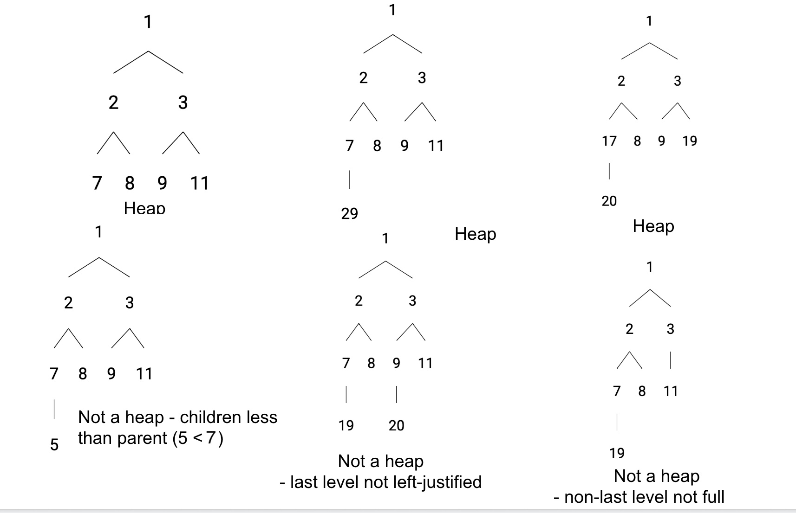

# Priority Queue and Heap

## What is the relationship between priority queue and heap?

Priority Queue is an Abstract Data Type, and Heap is the concrete data structure we use to implement a priority queue

## Priority Queue

Priority queue adalah struktur data yang terdiri dari sekumpulan item dan mendukung operasi berikut:

- insert: memasukkan item dengan sebuah key.
- delete_min/delete_max: menghapus item dengan key terkecil/terbesar dan mengembalikannya.

Perlu dicatat bahwa

kita hanya dapat mengambil dan menghapus elemen dengan key min/max dan TIDAK sembarang key.

## Use cases

Proses triase di rumah sakit adalah contoh utama penggunaan priority queue. Pasien diurutkan berdasarkan tingkat keparahan kondisinya. Misalnya, seseorang dengan flu datang dan ditempatkan di akhir antrian. Kemudian, seseorang yang mengalami kecelakaan mobil datang dan ditempatkan sebelum orang dengan flu meskipun datang belakangan karena kondisinya lebih parah. Dalam kasus ini, tingkat keparahan menjadi key.

Pertimbangkan masalah seperti Merge K sorted lists. Kita perlu melacak nilai minimum di antara k elemen (elemen terkecil dari setiap list yang sudah terurut) dan menghapus nilai minimum serta memasukkan nilai baru kapan saja, sambil tetap dapat mengakses nilai minimum setiap saat. Berikut beberapa masalah lain di mana priority queue sangat berguna:

- k closest points to origin <https://leetcode.com/problems/k-closest-points-to-origin/>
- kth largest element <https://leetcode.com/problems/kth-largest-element-in-an-array/>
- kth largest element in a stream <https://leetcode.com/problems/kth-largest-element-in-a-stream/>
- Median of a data stream <https://leetcode.com/problems/find-median-from-data-stream/>
- Uniform Cost Search <https://algo.monster/problems/uniform-cost-search>

## Implement Priority Queue using an array

Untuk melakukan ini, kita bisa mencoba menggunakan:

- Array tak terurut (unsorted array): operasi insert akan memiliki kompleksitas waktu O(1) karena kita cukup menambahkan elemen di akhir array. Namun, untuk menemukan dan menghapus nilai minimum, kompleksitasnya menjadi O(N) karena kita harus melakukan iterasi ke seluruh elemen array untuk menemukannya.
- Array terurut (sorted array): menemukan nilai minimum menjadi mudah dengan kompleksitas O(1), tetapi operasi insert akan memakan waktu O(N) karena kita harus mencari posisi yang tepat untuk nilai tersebut, lalu menggeser elemen-elemen setelahnya untuk memberi ruang dan menyisipkan nilai ke posisi tersebut.

## Heap Data structure

**Heap** adalah struktur data berbasis pohon yang bersifat khusus. Biasanya, ketika kita menyebut **heap**, yang dimaksud adalah **binary heap** yang menggunakan struktur **binary tree** (pohon biner). Namun, pohon tersebut tidak selalu harus bersifat biner. Secara khusus, terdapat **k-ary heap** (juga dikenal sebagai **k-heap**), yaitu pohon di mana setiap simpul memiliki *k* anak. Selama setiap simpul mengikuti **dua properti heap**, maka struktur tersebut tetap dianggap sebagai heap yang valid.

## Two Heap Properties

Terdapat dua jenis heap — **Min Heap** dan **Max Heap**. Sebuah Min Heap adalah pohon yang memiliki dua properti:

1. Hampir lengkap (almost complete), yaitu setiap level terisi penuh kecuali mungkin level terakhir (yang paling dalam). Elemen-elemen yang terisi di level terakhir disusun rata kiri (left-justified).
2. Untuk setiap simpul (node), key-nya (prioritasnya) lebih besar daripada key milik induknya (parent) — inilah ciri khas Min Heap.

Sedangkan Max Heap memiliki properti #1 yang sama, tetapi ***properti #2 yang berlawanan***, yaitu: untuk setiap simpul, key-nya lebih kecil daripada key milik induknya.
Mari kita mainkan permainan "apakah ini sebuah heap?" pada struktur binary heap!

## Mengapa Heap Sangat Berguna

Beberapa alasan mengapa struktur data heap sangat berguna:

- Karena **heap adalah pohon lengkap** (*complete tree*), tinggi dari heap dijamin memiliki kompleksitas waktu **O(log(N))**. Ini berarti operasi yang berjalan dari akar ke daun akan memiliki kompleksitas **O(log(N))**.

- Karena hanya **simpul-simpul dalam jalur dari akar ke daun** yang terurut (simpul-simpul dalam level yang sama tidak terurut), saat kita menambahkan atau menghapus simpul, kita hanya perlu memperbaiki urutan pada jalur vertikal tempat simpul tersebut berada. Hal ini membuat operasi *insert* dan *delete* juga memiliki kompleksitas **O(log(N))**.

- Sifat **pohon lengkap** juga menjadikan **array** sebagai pilihan yang baik untuk menyimpan heap karena data tersusun secara kontinu. Seperti yang akan dibahas lebih lanjut dalam modul ini, kita dapat menemukan **induk (parent)** dan **anak (children)** dari suatu simpul hanya dengan melakukan **aritmetika indeks**.
